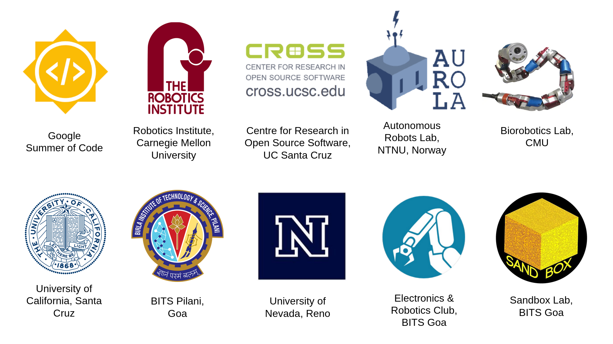

# About Me
---
I am a Research Assciate at the **Biorobotics Lab** at **Carnegie Mellon University** with a Bachelor's in Engineering (B.E.) in **Computer Science** from **BITS Pilani Goa**.

I find the fields of Autonomous Robotics, Computer Vision and AI fascinating. For the past four years, I have been working in several projects related to _Perception in Robots, Simultaneous Localization & Mapping (SLAM), Path Planning, Classical & DL-based computer vision_ and _Multi-robot systems_. Furthermore, I am also interested in working on research projects in semantic scene understanding for robots, Perception-aware planning in robots and space robotics.

I have previously worked as an Undergraduate Researcher in the **Autonomous Robots Lab, NTNU** under Prof. Kostas Alexis and as an intern at **Google Summer of Code** with the **Centre for Research in Open Source Software, UC Santa Cruz** & the **Autonomous Systems Lab** of UCSC.
I was formerly the **Sub-Coordinator** of the **Electronics & Robotics Club** of BITS Goa. I am currenty working under Dr. Matt Travers and Dr. Howie Choset at CMU.

 

