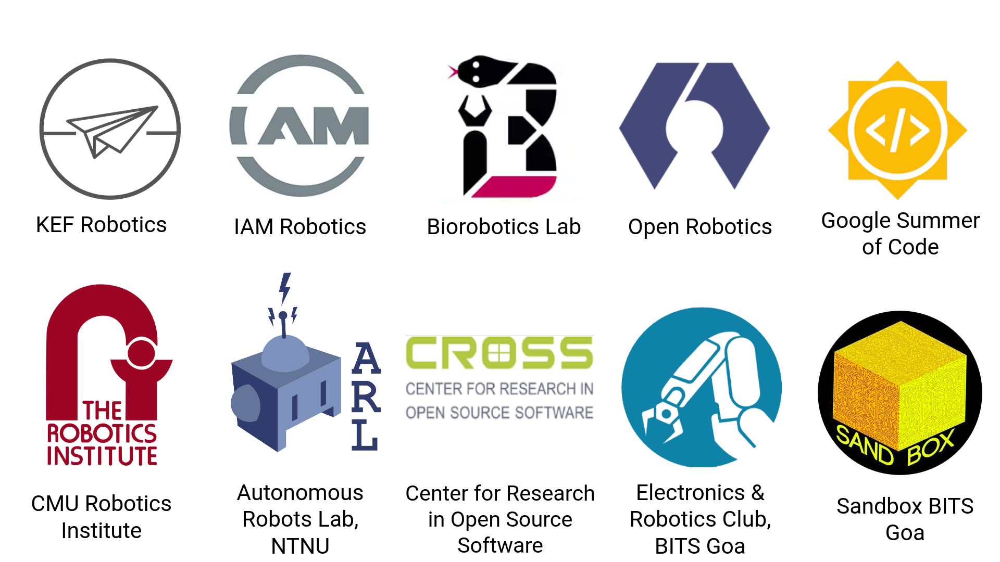
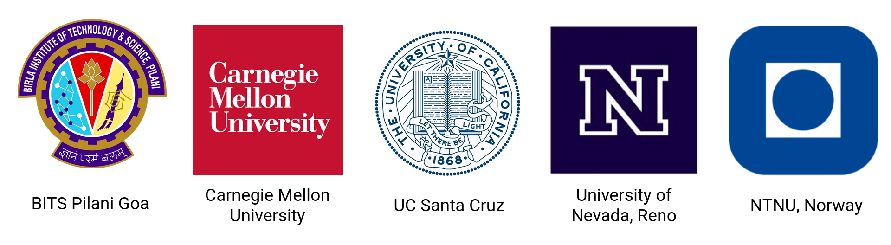

# About Me
---

I am a roboticist with a passion for autonomous navigation, computer vision and AI. My research interests are centered around **perception and path planning for mobile robots**, specifically in challenging and unstructured environments. This includes topics such as sensor fusion, simultaneous localization and mapping (SLAM), perception-aware planning, and semantic scene understanding. I am constantly seeking to learn more and develop innovative solutions in these areas, with the ultimate goal of applying them to real-world scenarios such as space exploration and search & rescue.

Throughout my career, I have had the opportunity to work on various research projects in this field. I have worked as a Perception Engineer at **IAM Robotics** and as a Research Associate at the **Biorobotics Lab** in the Robotics Institute at **Carnegie Mellon University**. I have also gained valuable experience during my internships at **Open Robotics** and the **Autonomous Systems Lab at the UC Santa Cruz**. I did my undergraduate thesis was on Visual-Inertial SLAM for Underwater Robots at the **Autonomous Robots Lab in University of Nevada, Reno**. I also worked on motion planning for indoor robots, robot swarms and modular robots during my undergraduate studies at **BITS Goa (India)**, where I acquired a degree in Computer Science and designed & taught several courses in Robotics. 

I am always eager to continue learning and expanding my knowledge in the field of robotics and looking for new opportunities to contribute to the robotics community. 
 

Companies, research labs and other organizations that I have worked with

 

Universities that have supported my projects

